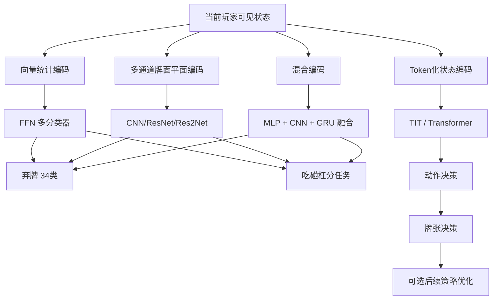

# 中国国标麻将监督学习智能体的架构与策略分析报告

## 执行摘要

本报告聚焦**中国国标麻将四人麻将**，即 Mahjong Competition Rules 或 Official International Mahjong，不把“以强化学习为主、监督学习仅作预训练”的方案当作主线，但会把“监督学习为核心、后续再做少量策略优化”的方案单独标注。综合近五年公开论文、官方竞赛综述、竞赛页面和开源仓库，当前**公开、可核验、与工程实现最相关**的监督学习路线主要集中在 Botzone / IJCAI Mahjong 生态，结构上可以概括为三类：**向量式 FFN 行为克隆**、**CNN/ResNet/Res2Net 多头分类器**、以及**Transformer 或混合式 MLP+CNN+RNN 的分层决策模型**。官方综述也明确指出，在第二届 IJCAI 国标麻将竞赛中，监督学习已被广泛采用，并构成前 16 强中的多数；同时，多数强队都把可见信息完整编码为当前玩家视角的多通道张量或向量，再分解为弃牌、吃、碰、杠、胡等子决策，而不是使用单一“大一统”策略头。citeturn21view0turn21view4turn22view0

如果只看**纯监督学习、且公开指标最完整**的国标麻将成果，当前最强锚点是 2024 年的**多尺度骨干 CNN 模型**：其以 Res2Net50 为核心，使用增强后的数据，在 RTX 3090 Laptop GPU 上训练 5 天，模型规模约 **52M 参数**，报告的**动作准确率 93.47%**、**弃牌准确率 83.93%**、**鸣牌准确率 97.56%**，并称已部署到 Botzone，进入天梯榜前 1%。如果把“监督学习为主、随后再做策略优化”的方案也纳入，则 2024 年的 **Tjong** 是最有研究价值的代表：其监督学习阶段用 **519,338** 条 Botzone 对局日志、交叉熵损失、Adam、学习率 **1e-4**、batch size **1024** 训练 Transformer-in-Transformer 骨干；论文报告 **Tjong-1** 在动作准确率、弃牌准确率和鸣牌准确率上均优于等参的 MLP、CNN、RNN、ResNet、ViT、TIT 基线，而完整 Tjong 再叠加分层决策与番回溯后，在在线天梯长期稳定保持前 1%，并进入 2023 IJCAI 决赛。citeturn25search2turn25search3turn27search0turn27search4turn19search2turn14view0turn16view0turn15view0

对工程实现而言，最稳妥的路线不是直接复刻 RL 大系统，而是按预算分层：**轻量方案**先做“可见信息完整编码 + 多模型监督学习”，例如 FFN 或轻量 ResNet；**中等方案**采用“MLP 统计分支 + CNN 牌面分支 + GRU 弃牌序列分支”的混合结构；**高性能方案**再上 Tjong 式的分层 Transformer。当前公开资料暴露的共性短板也很一致：**对手建模不足、忽略弃牌时序、标签噪声高、对 8 番门槛与长期做番规划不够、以及缺少统一延迟/并发评测**。对应地，最有效的改进通常是：保留弃牌顺序、显式建模未见牌数、按动作拆模型或按层级拆决策、用强 AI 自对弈日志替代低质量人类数据、以及把“番型目标”从隐式统计规律提升为显式结构偏置。citeturn21view0turn21view4turn30view0turn32view0turn52view0turn53view2turn43view2turn51view1turn51view2

优先参考：**Tjong 2024**、**Official International Mahjong 2023**、**国标麻将的多尺度骨干神经网络模型 2024**、**ai4mahjiong**。citeturn19search2turn20view0turn25search3turn35view0

## 目标范围与证据基础

本报告所说的“国标麻将”指官方竞赛采用的 **Mahjong Competition Rules**，其规则基础来自中国麻将竞赛规则；Botzone 的 IJCAI 2020 与 2022 麻将竞赛都明确说明比赛基于这套规则。时间范围按你的要求优先覆盖 **2019–2026**，但为了说明一些今天仍在沿用的结构设计，也补充了少量更早的经典工作，并在表中明确标注是否为**其他变体**。citeturn22view0

证据上，这个方向和日麻相比仍然**公开资料偏少**。高置信度来源主要有四类：一是官方竞赛综述与竞赛页面；二是近两年直接针对国标麻将的论文；三是公开 GitHub 工程实现；四是平台或技术博客中的工程复盘。一个重要现实判断是：**公开可验证的“纯监督学习、国标麻将、性能较好”的论文并不多**，很多强队经验事实上散落在竞赛 slides、仓库代码或平台文章中。因此，下面的结论会明确区分“论文直接给出的事实”“开源代码可确认的事实”和“基于多源证据的工程推断”。citeturn21view0turn22view0turn30view0turn35view0

从官方综述看，第二届 IJCAI 国标麻将竞赛中，监督学习被更广泛地使用，并占前 16 强中的多数；同时，监督学习模型之间的主要差异集中在**特征设计、网络骨干和数据预处理**三处。官方还指出，第一届比赛提供的是约半百万局、来自**另一麻将变体**的人类数据，质量偏低；第二届则提供了 **9.8 万+** 局由首届强 AI 自对弈生成的数据，策略质量更高。这一点对你做 bot 很关键：**国标麻将的 SL 上限高度依赖 teacher 质量**，而不是只看网络是否更深。citeturn21view0turn21view4

### 关键论文与开源项目清单

| 名称 | 年份 | 规则/变体 | 性质 | 对本课题的价值 | 开源/可获得性 |
|---|---:|---|---|---|---|
| Official International Mahjong: A New Playground for AI Research | 2023 | 国标麻将 / MCR | 官方综述 | 竞赛生态、数据集、主流特征编码、SL/RL 方法分布的最好总览之一 | 论文公开；并指向 judge、FanCalculator 与数据集资源。citeturn20view0turn21view0turn21view4turn22view0 |
| Tjong: A transformer-based Mahjong AI via hierarchical decision-making and fan backward | 2024 | 国标麻将 / MCR | 监督学习为主，后续再做 PPO 微调 | 公开对比 MLP/CNN/RNN/ResNet/ViT/TIT；给出较完整训练细节与在线表现 | 论文称源码已开源到 GitHub；检索能看到仓库声明，但当前抓取未能直接验证可访问性。citeturn19search2turn14view0turn16view0turn15view0turn18view0 |
| 国标麻将的多尺度骨干神经网络模型 | 2024 | 国标麻将 / MCR | 纯监督学习 | 目前公开指标最强、且明确是 SL 主线的国标论文锚点 | 摘要公开；全文细节可得性一般。citeturn25search2turn25search3turn27search0 |
| ZhijieXiong/ai4mahjiong | 2025–2026 可见 | 国标麻将 / MCR | 开源工程 | 提供可运行环境、CNN 基线、混合 MLP+CNN+GRU 训练脚本与 Botzone 适配 | GitHub 公开。citeturn35view0turn39view0turn43view3turn47view0turn51view1 |
| Botzone sample program / judge / dataset / PyMahjongGB | 2020–2022 | 国标麻将 / MCR | 基础设施 | 复现实验、规则判定、番数计算、评测赛制的基础 | 官方竞赛页面公开入口。citeturn22view0turn20view0 |
| 基于深度学习设计与实现国标麻将 AI 程序 | 2023 | 国标麻将 / MCR | 工程复盘 | 用人类数据做 FFN 行为克隆，公开输入设计、损失、优化器和比赛成绩 | 文章公开，适合作为轻量化起点。citeturn52view0turn53view2 |
| Realizing a four-player computer mahjong program by supervised learning with isolated multi-player aspects | 2014 | **日麻/其他变体** | 经典早期监督学习 | 早期提出将“单人做牌”和“多人防守/对手建模”拆开的思想 | 作为结构借鉴，不可直接拿来当国标结果。citeturn30view0turn53view2 |
| Gao et al., Supervised Learning of Imperfect Information Data in the Game of Mahjong via Deep CNNs | 2018 | **日麻/其他变体** | 经典 CNN 监督学习 | 4×34 多通道牌面编码、拆分 discard/chi/pon 网络，对后续国标竞赛编码影响很大 | 作为编码借鉴，不可直接与国标成绩横比。citeturn25search5turn53view2 |

优先参考：**Official International Mahjong 2023**；**Tjong 2024**；**国标麻将的多尺度骨干神经网络模型 2024**；**ai4mahjiong**。citeturn20view0turn19search2turn25search3turn35view0

## 架构与输入输出设计

官方竞赛综述给出的观察非常一致：国标麻将监督学习智能体大多从**当前玩家可见信息**出发，输入通常包含当前手牌、四家副露及其类型、四家弃牌、圈风/门风，以及未见牌数量等统计；输出则通常不是一个统一的大策略头，而是拆成**弃牌、吃、碰、杠、胡**等若干分类问题。综述还特别指出，一些队伍因为**忽略弃牌顺序**或把不同类型信息强行合并，造成明显的信息损失。也就是说，在国标麻将里，“可见信息完整性”和“时序保真”往往比把 backbone 从 A 换成 B 更先决定上限。citeturn21view0

从公开成果来看，**FFN/MLP** 路线适合作为轻量基线：把牌面和公开信息统计成中低维向量，分别训练 discard / chi / peng / gang 分类器；**CNN/ResNet** 路线是竞赛里最普遍、最稳的中坚架构，因为它更容易学习顺子、刻子、搭子等局部牌型模式；**Transformer/TIT** 在公开论文里表现出了更好的全局依赖建模能力，尤其适合与分层动作设计结合；而**混合式 MLP+CNN+GRU** 则是一条非常工程化的折中路线，把统计量、局部牌型和弃牌时序分别建模，再在输出前融合。citeturn21view0turn16view0turn51view1turn51view2

### 方法比较表

| 架构类型 | 代表工作 | 输入表示 | 输出空间 | 优点 | 局限 | 参数规模 | 推理延迟公开值 | 训练资源需求 |
|---|---|---|---|---|---|---:|---|---|
| 纯 FFN / MLP 多分类器 | 阿里云工程复盘 | 9 个 34 维统计向量 + 12 维吃/碰/杠次数 + 上家弃牌 one-hot，总计 **352 维**；不显式保留时序。citeturn53view2 | 弃牌 34 类；碰/杠 2 类；吃 4 类；暗杠/补杠部分用规则。citeturn53view2 | 实现简单、训练快、易部署；适合先把规则交互和数据流水线跑通。citeturn52view0turn53view2 | 难以表达弃牌顺序、局部牌型空间结构和长期做番；作者自己也指出 8 番门槛和防守是难点。citeturn52view0turn53view2 | **约 4.6M**（按公开层宽估算） | 未说明 | Batch 1024、Epoch 400，训练资源未说明。citeturn53view2 |
| 轻量 CNN / ResNet 多模型 | ai4mahjiong `PlayModel/FuroModel`；竞赛常见 ResNet/ResNeXt | `model_train1.py` 采用 **28 通道**输入；竞赛综述中更常见的是**4 通道图像化牌面**或多通道可见信息平面。citeturn39view0turn21view0 | `Play` 34 类；`Chi/Peng/Gang/AnGang/BuGang` 二分类或分任务输出。citeturn35view0turn39view0 | 擅长抓顺子/刻子等局部组合；实现成熟；是竞赛中最常见、最稳的主干。citeturn21view0turn47view0 | 对弃牌顺序和长程时序不敏感；若只看静态平面，隐信息与攻防切换学得不深。citeturn21view0turn30view0 | **约 2.0M–2.4M**（默认 5 个 ResBlock 时估算） | 未说明 | Adam，lr=1e-4，wd=1e-6，batch 1024，epochs 10；硬件未说明。citeturn39view0turn47view0 |
| 多尺度 CNN / Res2Net50 | 《国标麻将的多尺度骨干神经网络模型》 | 摘要只明确为“多尺度骨干深度网络 + 数据增强”；具体特征平面细节**未说明**。citeturn25search2turn27search0 | 动作、弃牌、鸣牌三类指标都报告了准确率；更细输出头结构**未说明**。citeturn25search2turn25search3 | 公开纯 SL 论文中指标最强；多尺度特征对局部牌型和更大上下文兼顾更好。citeturn25search2turn25search3 | 52M 参数偏大；全文公开细节不足，尤其是输入编码、loss 分解、延迟指标。citeturn25search2turn27search0 | **52M** | 未说明 | RTX 3090 Laptop GPU 上训练 5 天。citeturn25search3 |
| 纯 RNN 基线 | Tjong 论文中的等参 RNN 对照 | 论文确认参与了与 MLP/CNN/ResNet/ViT/TIT 的等参比较，但**具体输入组织和层数未说明**。citeturn13view3turn16view0 | 用于动作预测基线比较；具体 heads **未说明**。citeturn16view0 | 比 MLP 更能表达顺序。citeturn16view0 | 在公开对照中明显落后于 CNN/ResNet/TIT；说明纯时序 backbone 对国标可见状态并不够。citeturn16view0 | **15M**（与其他对照等参） | 未说明 | 与其他对照同资源设置；监督阶段总训练约 7 天。citeturn13view3turn14view0 |
| ViT / TIT Transformer 基线 | Tjong 论文中的 ViT、TIT 对照 | 论文公开为 Vision Transformer 与 Transformer-in-Transformer 对照；可确认是统一等参比较，但可见状态 token 化细节在可访问文本中**未完整披露**。citeturn13view3turn16view0 | 动作预测。citeturn16view0 | 能捕捉更强的全局依赖。citeturn16view0 | 若不结合分层动作设计，仅 backbone 升级并不足以吃满收益。citeturn16view0 | **15M**（等参） | 未说明 | 与 Tjong-1 相同监督设置。citeturn13view3turn14view0 |
| 分层 Transformer / TIT | **Tjong / Tjong-1** | 论文使用 TIT 骨干，并把决策拆为**动作决策**与**牌张决策**两层；具体 state token 细节在可访问文本中未完全展开。citeturn13view1turn13view2 | 第一层先判定 8 类动作；第二层再做弃牌或吃碰杠的牌张选择。citeturn13view1 | 公开论文里准确率最全面、对照最系统；分层显著降低输出空间复杂度。citeturn13view1turn16view0 | 最终最强版本仍借助后续 PPO；纯监督学习阶段已很强，但长期规划仍有上限。citeturn19search2turn15view0 | **15M** | 未说明 | 2×2080Ti，监督阶段约 7 天。citeturn19search2turn15view0 |
| 混合 MLP + CNN + GRU | ai4mahjiong `DeepNetwork/Network` | **288 维 MLP 特征** + **4×34 CNN 特征** + 弃牌序列 embedding/GRU；这是当前公开仓库里最完整的国标“混合监督学习”实现之一。citeturn43view3turn51view1turn51view2 | `Play` 34 类，`Gang` 4 类，其余部分任务按 1 类/二元 mask 输出；仓库把不同动作拆成独立任务。citeturn43view3turn35view0 | 同时利用统计量、局部牌型和时序；是很适合工程迭代的中档结构。citeturn51view1turn51view2 | 公开性能尚无正式论文背书；实现复杂度高于纯 CNN。citeturn35view0turn41view0 | **约 0.56M–0.83M**（按默认超参估算，依 head 而变） | 未说明 | AdamW、batch 1024、max epochs 20，带 warmup/调度、噪声和增强。citeturn43view1turn43view3turn43view2 |

就本次检索覆盖的公开论文、竞赛综述与仓库而言，**没有检出“以 GNN 为主干、面向国标麻将、且有公开性能报告”的成熟监督学习代表作**。如果你的目标是做一个近期可复现、能在 Botzone 或自建对局平台上稳定工作的 bot，优先级应显著放在 **CNN / Transformer / Hybrid** 三条线上，而不是 GNN。这个判断是基于公开证据覆盖范围的工程推断。citeturn21view0turn30view0turn35view0turn19search2

一个最值得直接拿去实现的**输入编码示例**，是把 34 种基础牌表示成多通道平面。官方综述提到很多国标队伍借鉴了 Suphx 这类“4 通道图像化牌面”的思路；而 `ai4mahjiong` 的混合模型代码也明确使用了 **4×34** 的 CNN 牌面特征，并把出牌序列单独送入 GRU。一个实用的最小示意如下：第 0–3 个通道表示某张牌的第 1–4 张拷贝，长度 34 对应万/条/筒/字牌索引；公共信息（副露、弃牌、风位、未见牌数）则可以用额外通道或并行 MLP 分支补充。citeturn21view0turn43view2turn51view1turn51view2

优先参考：**Official International Mahjong 2023**；**Tjong 2024**；**ai4mahjiong 代码**；**阿里云国标麻将 FFN 工程复盘**。citeturn21view0turn19search2turn35view0turn53view2

## 数据、标注与训练细节

在国标麻将监督学习里，**数据质量基本决定上限**。官方竞赛页面说明，第一届数据集约为 **50 万局**人类对局，但来自**另一麻将变体**，因此虽然基础动作规则相近，却存在策略分布偏差；第二届数据集则是 **98,000+** 局由首届强 AI 在 Botzone 上生成的自对弈数据，策略质量明显更高。Tjong 的监督阶段再往前一步，直接使用了 **519,338** 条 Botzone battle log；而阿里云工程文中则选取约 **50 万局**人类对局，并进一步**只保留和牌人的行为序列**作为监督样本，以提升 teacher 质量。这里能看出三类主流 teacher：**低噪声人类赢家轨迹**、**强 AI 自对弈轨迹**、以及**竞赛日志回放**。citeturn21view4turn19search2turn52view0turn53view2

标签类型方面，公开国标麻将 SL 工作几乎都还是**行为克隆式的 state→action 学习**。Tjong 在训练中把动作与牌张选择都当作标签，用准确率与交叉熵评估；`ai4mahjiong` 也明确把“动作前状态”作为样本特征、把动作作为标签，并把 `Play/Chi/Peng/Gang/AnGang/BuGang` 拆开训练；阿里云工程同样对 discard、chi、peng、gang 分别训练分类器。公开资料里，**“策略分布蒸馏”或“监督学习价值估计”并不是国标麻将主流**；真正的 value head、多头 actor-critic 主要出现在 RL 或 SL+RL 过渡方案。citeturn19search2turn35view0turn39view0turn53view2

在**去噪与去偏**上，公开资料最有启发的不是复杂 loss，而是**样本筛选和信息保真**。阿里云方案通过只采和牌人的序列来降低低质行为的干扰；官方综述则明确提醒，一些队伍因忽略弃牌顺序而丢失关键信息；第二届竞赛数据集改用强 AI 自对弈，本质上也是对 teacher 偏差的修正。换句话说，国标麻将的 SL 里，“保留弃牌顺序、避免错变体 teacher、优先强 AI 生成样本”往往比“再多加两层网络”更有效。citeturn21view0turn21view4turn52view0turn53view2

在**数据增强**上，公开、可直接复用的最好样例来自 `ai4mahjiong` 的混合脚本：它对手牌计数做**边张镜像增强**、**随机丢牌**、**顺子相关牌左右平移**，还支持标签同步增强、输入噪声注入与预训练分支冻结。多尺度骨干论文也明确提到“对训练数据进行了数据增强”，但摘要并未披露具体做法。citeturn43view2turn43view1turn27search0

### 训练细节对照表

| 工作 | 数据来源 | 标签 | 损失函数 | 优化器 | 典型超参 | 训练时长/硬件 | 评估指标 |
|---|---|---|---|---|---|---|---|
| Tjong 监督阶段 | 519,338 条 Botzone battle log。citeturn19search2 | 动作与牌张选择。citeturn19search2 | Cross-Entropy。citeturn19search2 | Adam。citeturn19search2 | lr=1e-4，batch=1024。citeturn19search2 | 单机 32×Ryzen7 2700X CPU + 2×2080Ti；监督阶段约 7 天。citeturn19search2turn15view0 | Acc、loss、Hu Rate、Average Score。citeturn19search2turn16view0 |
| 多尺度 Res2Net50 | 基于 IJCAI 2020 冠军对局数据并增强。citeturn27search0turn21view0 | 动作、弃牌、鸣牌。citeturn25search2 | 未说明 | 未说明 | 未说明 | RTX 3090 Laptop GPU，训练 5 天。citeturn25search3 | 动作/弃牌/鸣牌准确率；Botzone 排名。citeturn25search2turn25search3 |
| ai4mahjiong 轻量 CNN | Botzone 强 AI 数据解析后切分 train/valid/test。citeturn35view0 | `Play` 34 类；其余多为二分类。citeturn35view0turn39view0 | `Play` 用 CrossEntropy，副露用 BCEWithLogits。citeturn39view0 | Adam。citeturn39view0 | num_layers=5，lr=1e-4，wd=1e-6，batch=1024，epochs=10。citeturn39view0 | CUDA if available；具体机器未说明。citeturn39view0 | 准确率与 loss。citeturn39view0 |
| ai4mahjiong 混合模型 | `sl_hybrid_data`，仓库支持预训练、噪声、增强。citeturn43view2turn43view3 | 分任务输出。citeturn43view3 | `Play`/副露按任务分损失；脚本含 mask。citeturn51view2 | AdamW。citeturn43view1 | dim_rnn=64，dropout=0.1，batch=1024，max_epochs=20。citeturn43view0turn43view1 | 具体机器未说明。citeturn43view1 | 脚本包含 accuracy；二元任务还引入 roc_auc_score。citeturn42view0turn43view1 |
| 阿里云 FFN 基线 | 约 50 万局人类对局，只取和牌人的行为序列。citeturn52view0turn53view2 | discard/chi/peng/gang 分类。citeturn53view2 | CrossEntropy。citeturn53view2 | Adam(lr=0.001, betas=(0.9,0.999))。citeturn53view2 | Batch 1024，Epoch 400，Dropout 0.3，BN。citeturn53view2 | 未说明 | 训练集准确率 70.3%，测试集约 69%。citeturn53view2 |

值得特别强调的是，**国标麻将公开论文几乎不报告分钟级或毫秒级推理延迟**。公开资料里更常见的，是“能否在 Botzone 受限环境中上线运行”和“天梯/复式比赛成绩”。因此在工程实现里，延迟评估最好不要等论文给答案，而应在你自己的推理链路上直接测：包括单步前向耗时、规则层开销、牌谱解析开销，以及并发时的 P99。这个判断与综述中提出的“未来评估应纳入响应速度”等结论是一致的。citeturn15view0turn25search3turn32view0

优先参考：**Tjong 训练设置**；**Official International Mahjong 数据集说明**；**ai4mahjiong 训练脚本**；**阿里云 FFN 工程细节**。citeturn19search2turn21view4turn39view0turn43view1turn53view2

## 性能评估与公开实现

从公开结果看，国标麻将监督学习路线已经证明了两件事。第一，**高质量数据下，SL 明显强于纯启发式**：官方综述直接给出结论，监督学习与强化学习都显著好于基于人类经验的启发式方法；同时，2022 年时监督学习已成为前 16 强的主流方法。第二，**纯 SL 并没有输掉牌桌**：虽然 2020 年的前三名都是 RL，但到 2022 年，随着强 AI 数据集可用，SL 成为了更可复制、更高性价比的主流路线。citeturn21view0turn21view4

### 公开性能对照

| 系统 | 是否纯监督学习 | 评测场景 | 公开结果 | 解读 |
|---|---|---|---|---|
| 多尺度 Res2Net50 | 是 | Botzone + 论文报告 | 动作准确率 **93.47%**、弃牌准确率 **83.93%**、鸣牌准确率 **97.56%**；Botzone 天梯前 1%。citeturn25search2turn25search3 | 这是目前公开资料里**最强的纯 SL 国标锚点**。 |
| Tjong-1 | 是 | 论文离线 duplicate 评测 | 动作准确率 **94.63%**、loss **0.19**；弃牌准确率 **81.51%**、鸣牌准确率 **98.55%**，优于等参 MLP/CNN/RNN/ResNet/ViT/TIT。citeturn16view0 | 说明**分层 + TIT 骨干**即便只做监督学习，也已经很强。 |
| Tjong 完整版 | 否，SL + PPO | 在线天梯 / IJCAI 2023 | 论文称在在线排名中长期保持前 1%，并进入 2023 IJCAI 决赛；在线平均得分较对照模型有大幅优势。citeturn15view0turn19search2 | 这是“监督学习为主、后续策略优化”的最佳公开例子。 |
| 阿里云 FFN 基线 | 是 | 校内/平台比赛 | 训练集 70.3%，测试集约 69%；模型增大后测试准确率再升约 2.5%，最终在 44 人比赛中获第 16 名。citeturn53view2 | 证明**低复杂度 FFN 也能起作用**，但上限不高。 |
| 2022 IJCAI 竞赛中的 SL 体系 | 是或以 SL 为主 | 官方竞赛 | 官方综述指出第二届比赛中监督学习被广泛采用，并占 top 16 多数。citeturn21view0 | 从“生态结果”上证明 SL 已是国标麻将主流强方案之一。 |

这里还有一个很重要的细节：Tjong 论文内部不是只和一个 baseline 比，而是明确把 **MLP、CNN、RNN、ResNet、ViT、TIT** 做成**15M 等参比较**。公开结果显示，Tjong-1 不仅动作准确率最高，而且 loss 更低；这说明在国标麻将里，真正决定性能的不只是“是否上 Transformer”，还包括**动作分层**和**针对牌张选择的结构化输出**。如果你要做工程取舍，这比单纯照搬通用视觉 backbone 更值得学。citeturn13view1turn13view3turn16view0

### 开源实现与可复现实验资源

| 资源 | 作用 | 复现价值 | 当前状态 |
|---|---|---|---|
| `ai4mahjiong` | 提供国标麻将环境、Botzone 数据解析、CNN 基线、混合模型训练脚本、Bot 提交示例。citeturn35view0turn39view0turn43view3 | 对工程最友好，适合直接改成你自己的 bot。 | GitHub 公开，且 README 明确给出训练与提交路径。citeturn35view0 |
| Botzone judge program / sample program | 规则一致性的基准环境。citeturn22view0 | 避免你自写 judge 时把规则、吃碰杠时机或 8 番判定写偏。 | 官方竞赛页可获取入口。citeturn22view0 |
| PyMahjongGB / FanCalculator | 番数计算与和牌判定。citeturn20view0turn22view0 | 对国标麻将是刚需，不建议自己重写。 | 官方资源公开。citeturn20view0turn22view0 |
| Tjong | 高性能研究原型。citeturn19search2turn15view0 | 适合学习分层动作建模与 TIT 骨干。 | 论文声明已开源，但当前网页抓取无法直接验证仓库可访问性。citeturn19search2turn18view0 |

如果你的目标是**先做出可运行、可调、可在线打的国标 bot**，我会把复现优先级排为：**Botzone judge / FanCalculator → ai4mahjiong 轻量 CNN → ai4mahjiong 混合模型 → Tjong 风格分层 Transformer**。这个顺序的原因不是“论文级新颖性”，而是**规则正确性、数据流水线稳定性、训练闭环、上线闭环**要先于追求最高论文分数。这个判断基于官方竞赛资源的组织方式和公开工程的成熟度。citeturn22view0turn35view0turn43view3turn19search2

优先参考：**多尺度 Res2Net50 2024**；**Tjong 2024**；**Botzone 2022 官方页面**；**ai4mahjiong**。citeturn25search3turn19search2turn22view0turn35view0

## 工程落地建议与改进方向

由于你的场景里**硬件预算、延迟目标、是否移动端部署都未指定**，最合理的实现方式是把方案分成轻量、中等和高性能三档，而不是一开始就赌最重的模型。轻量档应优先选 **FFN 或浅层 ResNet 多模型**：它们能最快把数据管线、规则层、动作 mask、番数判定和在线交互打通；中等档建议上 **MLP+CNN+GRU** 混合结构，因为它兼顾统计、牌型局部结构和弃牌顺序；高性能档才考虑 **Tjong 式 TIT + 分层动作决策** 或 **52M 的 Res2Net50**。这个分档不是论文原文直接给出的结论，而是基于公开模型规模、训练资源和结构复杂度做出的工程推断。citeturn53view2turn47view0turn51view1turn51view2turn25search3turn19search2

最常见的问题首先是**过拟合和 teacher 噪声**。阿里云方案用 BN + Dropout 并通过样本筛选提高 label 质量；`ai4mahjiong` 的混合模型则进一步引入手牌镜像、平移、丢牌增强和噪声注入；官方竞赛数据集从“另一变体的人类数据”切换到“强 AI 自对弈数据”，也是在用更强 teacher 降噪。所以，如果你在自己的 bot 上看到“validation acc 还行，但实战波动大”，优先检查的通常不是 backbone，而是**样本来源、是否保留弃牌顺序、是否按动作类型做了足够干净的切分**。citeturn21view4turn52view0turn53view2turn43view2

第二个问题是**对手建模不足与隐信息处理弱**。纯 SL 国标模型大多只用“当前玩家可见信息”，对隐信息的处理主要依赖未见牌计数、弃牌历史和统计近似，而不是显式潜变量推断。经典麻将研究很早就把“单人做牌”和“对手建模”拆开；阿里云文也直说他们的国标方案在防守方面较弱。对你来说，最实用的改进不是直接上复杂贝叶斯隐变量模型，而是先做三件事：**保留弃牌顺序；显式加入未见牌数与对手副露类型；为每个对手建立独立的序列或 risk 分支**。公开国标资料虽未形成统一标准，但方向上高度一致。citeturn30view0turn52view0turn53view2turn21view0

第三个问题是**长期规划能力不足，尤其是 8 番门槛与高番型目标选择**。阿里云工程把“决定之后游戏策略、和牌目标”直接定义为最难的问题，并指出简单基线经常出现“牌型够和但番数不够”；Tjong 则通过把决策拆成“动作决策→牌张决策”并加入番回溯，来缓解这种长期目标缺失。对国标麻将而言，这一点比在日麻里更敏感，因为它有明确的**8 番起和**约束。工程上，最值得复用的做法有两种：一是 **hierarchical policy**，先决定“做什么”，再决定“出哪张/吃哪口”；二是给模型增加**番型目标或可和番数相关的辅助信号**，不要只做短视的下一步行为克隆。citeturn52view0turn53view2turn13view1turn13view2

第四个问题是**评估体系过于单一**。综述明确批评当前评估往往只看胜率、动作准确率或排名中的一项，并建议把响应速度、点炮概率等也纳入；官方竞赛则采用 Swiss + duplicate 的组合来尽量降低运气因素。对你的 bot 而言，推荐至少同时保留四类指标：**离线动作准确率**、**复式对局平均得分**、**和牌率/点炮率**、**实测延迟与超时率**。文献里最后一项几乎都没写，但从工程上它是上线前必须补齐的一块。citeturn21view4turn32view0turn15view0

最后给一个面向实现的简洁建议：如果你现在就要开始写国标麻将 bot，最值得复制的并不是某一个“神奇模型”，而是下面这条路线：**先用 FanCalculator 和官方 judge 固化规则；再做按动作拆分的监督学习基线；随后在输入端补上弃牌顺序和未见牌统计；最后再决定是否升级到混合模型或 Tjong 风格的分层 Transformer**。这条路线与公开最强纯 SL 论文、最强 SL+优化论文，以及现成开源项目的共同经验是一致的。citeturn20view0turn22view0turn25search3turn19search2turn35view0

优先参考：**Tjong 2024**；**Official International Mahjong 2023**；**ai4mahjiong 训练与模型代码**；**阿里云国标麻将工程复盘**；**麻将博弈 AI 构建方法综述 2023**。citeturn19search2turn20view0turn35view0turn43view2turn53view2turn30view0